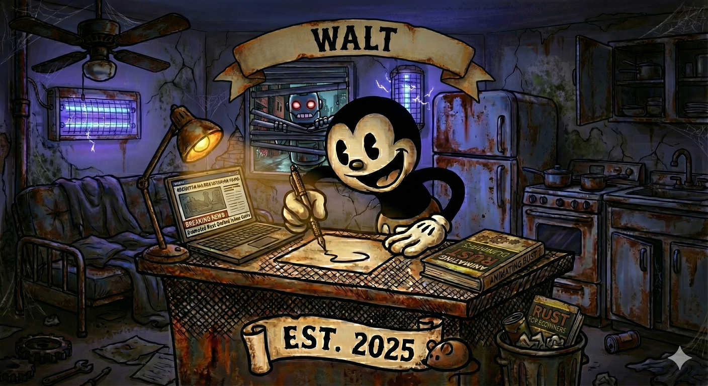

<p align="center">
  
</p>

<p align="center">
  <b>Rust &harr; Animated Rust Syntax Encoder/Decoder</b>
  <br />
  <br />
  <a href="https://github.com/rust-lang/rust"></a>
  <a href="LICENSE"></a>
</p>

---

**Walt** is an experimental command-line tool for encoding Rust source code into `.ars` (Animated Rust Syntax), a custom RON-based format, and decoding it back. It is an early foundation for code analysis, transformation, and visualization projects.

Parsing currently combines `syn`-based analysis of function bodies with lightweight regex extraction of top-level items. **Byte-exact round-tripping is a goal, not yet a guarantee** — see [Known limitations](#️-known-limitations) before relying on the output.

## Demonstration

The following demonstration shows the basic workflow of encoding a Rust source file and decoding it back.

*(To generate `demo.gif`, run `vhs demo.tape`)*
<p align="center">
  
</p>

## ✨ Features

-   **Structured Encoding**: Rust items are extracted into a typed, serde-serializable `.ars` model (RON format).
-   **Hybrid Parsing**: `syn` is used to analyze function bodies; top-level items are captured with targeted extractors.
-   **CLI Interface**: Two commands — `walt encode <input> <output>` and `walt decode <input> <output>`.
-   **Common Syntax Coverage**: Modules, traits, structs, enums, functions (incl. `async` and generics), consts, statics, macros, type aliases, and `use` statements.
-   **File & Directory Support**: Encode/decode single files or entire project directories recursively, preserving layout.

## ⚠️ Known limitations

This is a pre-1.0 experiment. Current round-trip behavior is **lossy**:

-   Item order is normalized by category on decode (e.g. all functions are emitted together); original interleaving is not preserved.
-   Comments and doc comments are not encoded and are dropped on decode.
-   Statement formatting inside function bodies is normalized (token-stream spacing).
-   Some complex signatures (e.g. `where` clauses, certain generic/return types) can be mis-parsed; always diff decoded output before use.

`./tester.sh` is the round-trip gate: it requires a byte-identical encode/decode cycle and currently documents the gap to close.

## 🚀 Installation

Ensure you have the Rust toolchain installed. You can then install `walt` directly from this repository.

1.  **Clone the repository:**
    ```sh
    git clone <repository_url>
    cd walt
    ```

2.  **Install the binary:**
    ```sh
    cargo install --path .
    ```
    This will compile and install the `walt` executable in your Cargo bin path.

## Usage

Walt's CLI has two commands: `encode` and `decode`.

### Encoding

```sh
# Encode a single file
walt encode <input.rs> <output.ars>

# Encode an entire directory
walt encode <input_directory> <output_directory>
```

### Decoding

```sh
# Decode a single file
walt decode <input.ars> <output.rs>

# Decode an entire directory
walt decode <input_directory> <output_directory>
```

## 🛠️ Development

To contribute or work on the project locally:

1.  **Build the project:**
    ```sh
    cargo build
    ```

2.  **Run tests:**
    ```sh
    # Run unit tests
    cargo test

    # Run the end-to-end round-trip gate (byte-identical required)
    ./tester.sh
    ```

## 📜 License

This project is licensed under the MIT License. See the [LICENSE](LICENSE) file for details.
